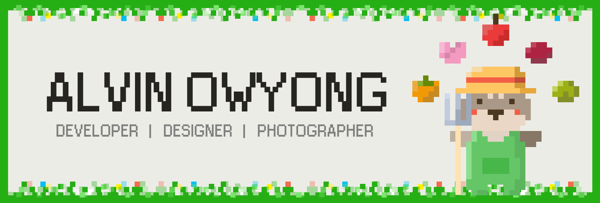

### Hi there 👋

- 💻 I'm Alvin, a Computer Science undergraduate from Singapore (UTC+8).
- 💼 I have worked on several full-stack client projects.
- 📸 I contribute to CC0 stock images over at [Pexels](https://www.pexels.com/@alvin-chelsea-230969113/).
- 💡 I'm open to opportunities to learn, write and speak about anything technical.

### Languages & Tools 🛠

<!--  -->

 

<table>
  <tr>
    <th>Frontend (Web)</th>
    <th>Backend</th>
    <th>Mobile</th>
    <th>Design</th>
  </tr>
  <tr>
    <td>
        
        
        
        
    </td>
    <td>
        
        
        
        
        
    </td>
    <td>
        
      
    </td>
    <td>
        
         
         
         
         
         
    </td>
  </tr>
</table>

<!--
**alvinowyong/alvinowyong** is a ✨ _special_ ✨ repository because its `README.md` (this file) appears on your GitHub profile.

Here are some ideas to get you started:

- 🔭 I’m currently working on ...
- 🌱 I’m currently learning ...
- 👯 I’m looking to collaborate on ...
- 🤔 I’m looking for help with ...
- 💬 Ask me about ...
- 📫 How to reach me: ...
- 😄 Pronouns: ...
- ⚡ Fun fact: ...
-->
